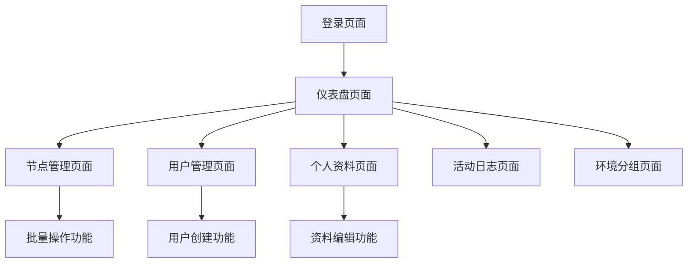

## 1. Product Overview
Go-CESI 高优先级功能增强版是一个现代化的 Supervisor 集中管理界面，新增了批量进程操作、完整的 React 前端应用和用户个人资料管理功能。该产品解决了多节点进程管理效率低下的问题，为系统管理员和开发人员提供了实时监控和批量操作的能力。产品目标是成为企业级进程管理的首选解决方案，提升运维效率和用户体验。

## 2. Core Features

### 2.1 User Roles
| Role | Registration Method | Core Permissions |
|------|---------------------|------------------|
| Admin User | 配置文件自动创建或命令行创建 | 完整系统管理权限，包括用户管理、节点管理、批量操作等 |
| Regular User | 管理员通过界面创建 | 基础监控和个人资料管理权限，可查看节点状态和进程信息 |

### 2.2 Feature Module
我们的 Go-CESI 高优先级功能包含以下主要页面：
1. **仪表盘页面**：系统概览、实时统计、节点状态监控、最新活动日志
2. **节点管理页面**：节点列表、进程状态、批量操作控制、实时更新
3. **用户管理页面**：用户列表、权限管理、用户创建和删除
4. **个人资料页面**：个人信息查看、密码修改、邮箱更新
5. **活动日志页面**：操作记录、系统事件、搜索过滤
6. **登录页面**：用户认证、会话管理
7. **环境分组页面**：节点环境分类、分组管理

### 2.3 Page Details
| Page Name | Module Name | Feature description |
|-----------|-------------|---------------------|
| 仪表盘页面 | 系统概览模块 | 显示节点总数、在线节点数、进程总数和运行中进程数的实时统计 |
| 仪表盘页面 | 实时事件模块 | 通过 WebSocket 接收并显示节点更新、进程状态变化等实时事件 |
| 仪表盘页面 | 最新活动模块 | 展示最近的用户操作和系统事件日志 |
| 节点管理页面 | 节点列表模块 | 显示所有配置的 Supervisor 节点及其连接状态、主机信息 |
| 节点管理页面 | 批量操作模块 | 提供一键启动、停止、重启节点上所有进程的功能 |
| 节点管理页面 | 实时监控模块 | 通过 WebSocket 实时更新节点状态和进程信息 |
| 用户管理页面 | 用户列表模块 | 显示所有用户账户、角色和状态信息 |
| 用户管理页面 | 用户操作模块 | 创建新用户、修改用户权限、删除用户账户 |
| 个人资料页面 | 资料查看模块 | 显示当前用户的用户名、邮箱、角色等基本信息 |
| 个人资料页面 | 资料编辑模块 | 允许用户修改邮箱地址和密码 |
| 活动日志页面 | 日志列表模块 | 显示所有用户操作和系统事件的详细记录 |
| 活动日志页面 | 搜索过滤模块 | 提供按时间、用户、操作类型等条件筛选日志的功能 |
| 登录页面 | 认证表单模块 | 用户名密码输入、登录验证、错误提示和加载状态显示 |
| 环境分组页面 | 环境分类模块 | 按生产、测试、开发等环境对节点进行分组显示 |

## 3. Core Process

### 管理员操作流程
管理员登录后可以访问所有功能模块。首先在仪表盘查看系统整体状态，然后进入节点管理页面查看具体节点信息。当需要维护时，可以使用批量操作功能一次性管理节点上的所有进程。管理员还可以在用户管理页面创建和管理其他用户账户。

### 普通用户操作流程
普通用户登录后主要使用监控功能。在仪表盘查看系统概览，在节点管理页面查看进程状态，在个人资料页面管理自己的账户信息。用户可以通过活动日志页面查看系统的操作记录。

### 批量操作流程
用户在节点管理页面选择目标节点，点击批量操作按钮（启动全部、停止全部、重启全部），系统通过 API 调用 Supervisor 接口执行操作，并通过 WebSocket 实时反馈操作结果和进程状态变化。

## 4. User Interface Design

### 4.1 Design Style
- 主色调：深蓝色 (#007bff) 和白色 (#ffffff)
- 辅助色：成功绿色 (#28a745)、警告橙色 (#ffc107)、危险红色 (#dc3545)
- 按钮样式：圆角按钮，支持悬停效果和加载状态
- 字体：系统默认字体栈，主要文字 14px，标题 18-24px
- 布局风格：卡片式布局，顶部导航栏 + 侧边栏的经典管理界面布局
- 图标风格：使用 Bootstrap Icons，简洁现代的线性图标

### 4.2 Page Design Overview

| Page Name | Module Name | UI Elements |
|-----------|-------------|-------------|
| 仪表盘页面 | 系统概览模块 | 四个统计卡片，使用蓝色主题，包含数字和图标，响应式网格布局 |
| 仪表盘页面 | 实时事件模块 | 滚动列表，每个事件项包含时间戳、事件类型和描述，使用不同颜色标识事件级别 |
| 节点管理页面 | 节点列表模块 | 表格布局，包含节点名称、状态指示器、主机信息和操作按钮 |
| 节点管理页面 | 批量操作模块 | 三个并排的操作按钮，绿色启动、橙色重启、红色停止，带确认对话框 |
| 个人资料页面 | 资料编辑模块 | 表单布局，输入框带验证提示，保存按钮带加载状态 |
| 登录页面 | 认证表单模块 | 居中卡片布局，品牌 Logo，输入框带图标，蓝色登录按钮 |

### 4.3 Responsiveness
产品采用移动优先的响应式设计，在桌面端提供完整功能，在平板和手机端自适应布局。侧边栏在小屏幕上可折叠，表格在移动端转换为卡片布局，支持触摸操作优化。