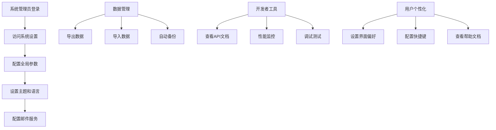

# Go-CESI 低优先级功能需求文档

## 1. 产品概述

本文档定义Go版本CESI应用的低优先级功能需求，这些功能虽然不是核心业务功能，但能显著提升用户体验、系统可维护性和扩展性。这些功能将在核心功能稳定后逐步实现。

## 2. 核心功能

### 2.1 用户角色

| 角色 | 注册方式 | 核心权限 |
|------|----------|----------|
| 系统管理员 | 系统初始化 | 可管理系统设置、主题配置、数据导入导出 |
| 普通管理员 | 系统管理员创建 | 可使用基础管理功能和部分系统工具 |
| 普通用户 | 管理员创建 | 可使用个性化设置和基础功能 |

### 2.2 功能模块

本次低优先级功能包含以下主要模块：

1. **数据管理页面**: 数据导入导出、备份恢复、数据清理
2. **系统设置页面**: 主题定制、多语言支持、系统参数配置
3. **开发者工具页面**: API文档、调试工具、性能监控
4. **用户体验页面**: 个性化设置、快捷键支持、帮助文档
5. **集成扩展页面**: 第三方集成、插件系统、Webhook支持

### 2.3 页面详情

| 页面名称 | 模块名称 | 功能描述 |
|----------|----------|----------|
| 数据管理 | 数据导出 | 支持导出配置、日志、用户数据为JSON/CSV格式 |
| 数据管理 | 数据导入 | 支持从文件导入配置和用户数据，包含数据验证 |
| 数据管理 | 备份管理 | 自动备份系统数据，支持定时备份和手动备份 |
| 数据管理 | 数据清理 | 清理过期日志、临时文件、无效数据 |
| 系统设置 | 主题定制 | 支持深色/浅色主题，自定义颜色方案 |
| 系统设置 | 多语言支持 | 支持中文、英文等多种语言界面 |
| 系统设置 | 系统参数 | 配置系统级参数，如会话超时、日志级别等 |
| 系统设置 | 邮件配置 | 配置SMTP服务器，支持邮件通知功能 |
| 开发者工具 | API文档 | 集成Swagger UI，提供完整的API文档 |
| 开发者工具 | 调试工具 | 提供API测试工具、日志查看器 |
| 开发者工具 | 性能监控 | 监控系统性能指标，API响应时间统计 |
| 用户体验 | 个人设置 | 用户个性化配置，如界面布局、默认视图 |
| 用户体验 | 快捷键 | 支持键盘快捷键操作，提高操作效率 |
| 用户体验 | 帮助文档 | 内置帮助文档和操作指南 |
| 集成扩展 | Webhook | 支持配置Webhook，向外部系统推送事件 |
| 集成扩展 | 第三方集成 | 集成Slack、钉钉等第三方通知服务 |
| 集成扩展 | 插件系统 | 支持插件扩展，允许自定义功能模块 |

## 3. 核心流程

### 数据管理流程
管理员可以定期导出系统数据进行备份，在系统迁移或恢复时导入数据。系统支持自动备份机制，确保数据安全。

### 系统配置流程
系统管理员可以配置全局设置，包括主题、语言、邮件服务等。普通用户可以配置个人偏好设置。

### 开发调试流程
开发者可以通过API文档了解接口规范，使用调试工具测试API，通过性能监控优化系统性能。

## 4. 用户界面设计

### 4.1 设计风格
- 主色调：继承系统主题，支持深色/浅色模式切换
- 辅助色：橙色 (#f59e0b) 表示警告，紫色 (#8b5cf6) 表示信息
- 按钮样式：与主系统保持一致，支持主题切换
- 字体：支持多语言字体，中文使用微软雅黑或系统默认
- 布局风格：标签页布局，便于功能分类管理
- 图标风格：使用Lucide React图标库，现代简洁

### 4.2 页面设计概览

| 页面名称 | 模块名称 | UI元素 |
|----------|----------|--------|
| 数据管理 | 导入导出 | 文件上传组件，进度条，数据预览表格 |
| 数据管理 | 备份管理 | 备份列表，定时任务配置，恢复向导 |
| 系统设置 | 主题配置 | 颜色选择器，主题预览，实时切换 |
| 系统设置 | 语言设置 | 语言下拉选择，实时切换预览 |
| 开发者工具 | API文档 | Swagger UI集成，搜索过滤功能 |
| 开发者工具 | 性能监控 | 实时图表，性能指标卡片，历史趋势 |
| 用户体验 | 个人设置 | 表单配置，实时预览，重置按钮 |
| 集成扩展 | Webhook配置 | URL输入，事件选择，测试按钮 |

### 4.3 响应式设计
所有低优先级功能页面都采用响应式设计，在移动设备上优化显示。复杂的配置页面在小屏幕上采用折叠面板和步骤向导的形式，确保良好的用户体验。