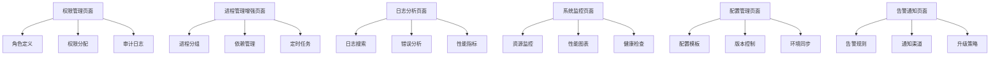

## 1. Product Overview
Go-CESI 中优先级功能增强版是在高优先级功能基础上的进一步完善，重点提升系统的权限控制、进程管理效率、日志分析能力和系统监控精度。该版本解决了企业级部署中的细粒度权限管理、高级进程操作、智能日志分析和性能监控等需求，为大规模生产环境提供更专业的运维管理能力。

## 2. Core Features

### 2.1 User Roles
| Role | Registration Method | Core Permissions |
|------|---------------------|------------------|
| Super Admin | 系统初始化创建 | 完整系统管理权限，包括系统配置、用户管理、全局设置等 |
| Environment Admin | Super Admin 创建 | 特定环境的完整管理权限，可管理环境内所有节点和用户 |
| Node Operator | Environment Admin 创建 | 特定节点的操作权限，可启停进程、查看日志 |
| Read-only User | 任意管理员创建 | 只读权限，可查看状态但不能执行操作 |

### 2.2 Feature Module
我们的 Go-CESI 中优先级功能包含以下主要页面：
1. **权限管理页面**：角色定义、权限分配、访问控制、审计日志
2. **进程管理增强页面**：进程分组、依赖管理、定时任务、批量配置
3. **日志分析页面**：日志搜索、错误分析、性能指标、告警规则
4. **系统监控页面**：资源监控、性能图表、健康检查、容量规划
5. **配置管理页面**：配置模板、版本控制、环境同步、配置验证
6. **告警通知页面**：告警规则、通知渠道、升级策略、静默管理

### 2.3 Page Details
| Page Name | Module Name | Feature description |
|-----------|-------------|---------------------|
| 权限管理页面 | 角色管理模块 | 创建自定义角色、定义权限范围、设置资源访问控制 |
| 权限管理页面 | 权限分配模块 | 为用户分配角色、设置节点访问权限、配置操作权限 |
| 权限管理页面 | 审计日志模块 | 记录权限变更、追踪用户操作、生成合规报告 |
| 进程管理增强页面 | 进程分组模块 | 按业务逻辑分组进程、设置分组依赖关系、批量操作分组 |
| 进程管理增强页面 | 依赖管理模块 | 定义进程启动顺序、设置依赖检查、自动化启停流程 |
| 进程管理增强页面 | 定时任务模块 | 配置定时启停、设置维护窗口、自动化运维任务 |
| 日志分析页面 | 日志搜索模块 | 全文搜索日志内容、按条件过滤、导出搜索结果 |
| 日志分析页面 | 错误分析模块 | 自动识别错误模式、统计错误频率、生成错误报告 |
| 日志分析页面 | 性能指标模块 | 分析进程性能数据、生成性能趋势图、设置性能阈值 |
| 系统监控页面 | 资源监控模块 | 监控CPU、内存、磁盘使用率、网络流量等系统资源 |
| 系统监控页面 | 性能图表模块 | 实时性能图表、历史数据对比、性能趋势分析 |
| 系统监控页面 | 健康检查模块 | 自动健康检查、服务可用性监控、故障自动发现 |
| 配置管理页面 | 配置模板模块 | 创建配置模板、参数化配置、模板继承和复用 |
| 配置管理页面 | 版本控制模块 | 配置版本管理、变更历史追踪、回滚功能 |
| 配置管理页面 | 环境同步模块 | 配置在不同环境间同步、差异对比、批量更新 |
| 告警通知页面 | 告警规则模块 | 设置告警条件、配置告警级别、自定义告警消息 |
| 告警通知页面 | 通知渠道模块 | 配置邮件、短信、Webhook等通知方式 |
| 告警通知页面 | 升级策略模块 | 设置告警升级规则、自动升级流程、责任人分配 |

## 3. Core Process

### 权限管理流程
Super Admin 创建环境管理员角色，为不同环境分配专门的管理员。环境管理员可以创建节点操作员，为特定节点分配操作权限。所有权限变更都会记录在审计日志中，确保操作可追溯。

### 进程管理增强流程
管理员首先按业务逻辑对进程进行分组，设置进程间的依赖关系。系统根据依赖关系自动计算启停顺序，支持批量操作和定时任务。进程状态变化会触发相应的通知和日志记录。

### 日志分析流程
系统自动收集所有节点的日志数据，通过全文索引支持快速搜索。错误分析模块自动识别异常模式，生成错误统计报告。性能指标模块分析进程运行数据，提供性能优化建议。

### 系统监控流程
监控代理持续收集系统资源数据，实时更新监控图表。健康检查模块定期检查服务状态，发现异常时自动触发告警。监控数据用于容量规划和性能优化。

## 4. User Interface Design

### 4.1 Design Style
- 主色调：深蓝色 (#1e40af) 和白色 (#ffffff)
- 辅助色：成功绿色 (#059669)、警告橙色 (#d97706)、危险红色 (#dc2626)、信息蓝色 (#0284c7)
- 按钮样式：圆角按钮，支持悬停效果和禁用状态
- 字体：系统默认字体栈，主要文字 14px，标题 16-20px，小字 12px
- 布局风格：卡片式布局，支持拖拽排序，可折叠面板
- 图标风格：使用 Heroicons 和 Bootstrap Icons，统一的线性图标风格

### 4.2 Page Design Overview

| Page Name | Module Name | UI Elements |
|-----------|-------------|-------------|
| 权限管理页面 | 角色管理模块 | 树形角色结构，权限矩阵表格，拖拽式权限分配界面 |
| 权限管理页面 | 审计日志模块 | 时间线布局，操作类型标签，搜索过滤器，导出按钮 |
| 进程管理增强页面 | 进程分组模块 | 可折叠的分组卡片，拖拽排序，批量操作工具栏 |
| 进程管理增强页面 | 依赖管理模块 | 流程图式依赖关系展示，连线表示依赖，节点表示进程 |
| 日志分析页面 | 日志搜索模块 | 搜索框带自动补全，高级过滤器，结果高亮显示 |
| 日志分析页面 | 错误分析模块 | 错误统计图表，错误类型饼图，趋势折线图 |
| 系统监控页面 | 资源监控模块 | 实时仪表盘，环形进度条，颜色编码的状态指示器 |
| 系统监控页面 | 性能图表模块 | 多指标折线图，时间范围选择器，图表缩放功能 |
| 配置管理页面 | 配置模板模块 | 代码编辑器界面，语法高亮，参数提示 |
| 配置管理页面 | 版本控制模块 | Git风格的版本历史，差异对比视图，分支管理 |
| 告警通知页面 | 告警规则模块 | 规则构建器，条件组合界面，测试按钮 |
| 告警通知页面 | 通知渠道模块 | 渠道配置卡片，测试发送功能，状态指示灯 |

### 4.3 Responsiveness
产品采用响应式设计，支持桌面端、平板和手机端访问。在移动端，复杂的表格转换为卡片布局，图表支持触摸缩放，侧边栏可折叠。权限管理和配置管理等复杂功能在移动端提供简化版界面，保证核心功能可用性。